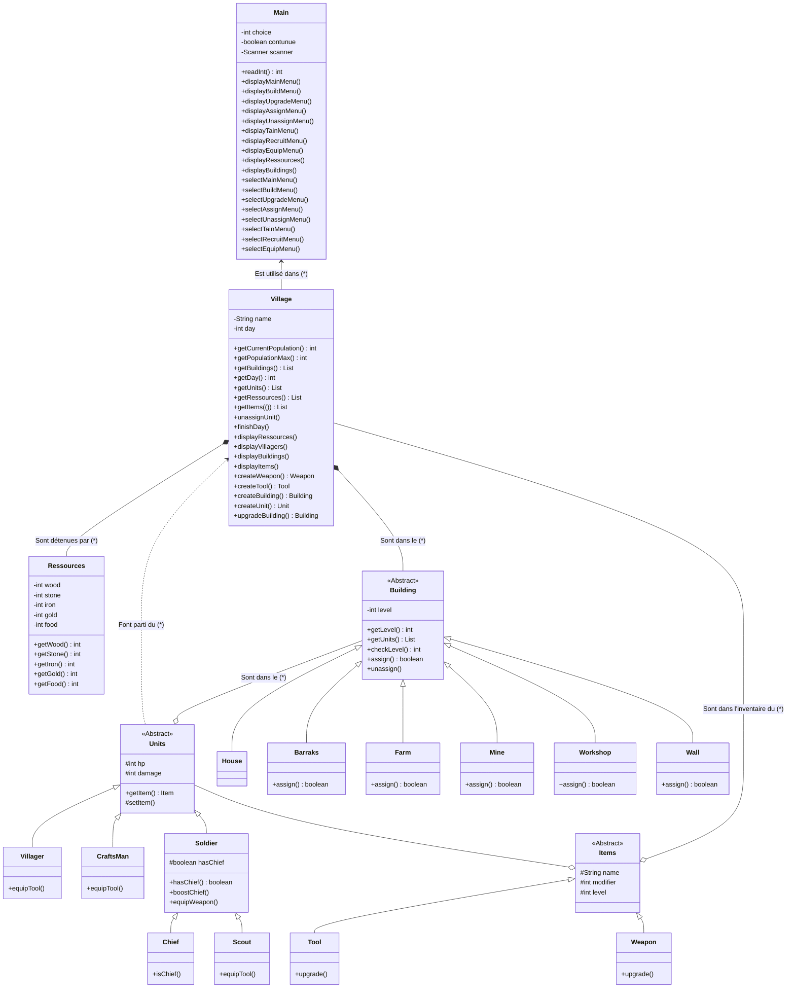
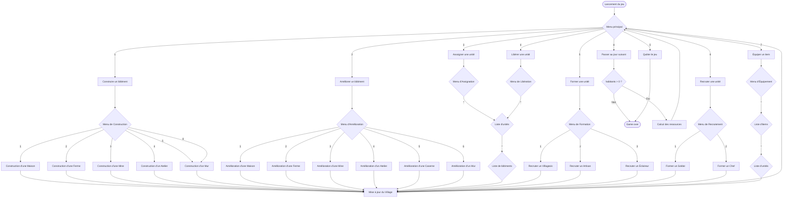

# JEmpireV2 [En cours de développement]

JEmpire est un jeu se jouant sur un terminal ayant pour but de faire survivre votre colonie le plus longtemps possible. Pour cela, vous pouvez créer différents batiments et unités, mais attention, chaque jour, des évènements viendront vous aider ou vous compliquer la tâche !

## Télécharger le jeu

Pour jouer, vous devez clone le projet sur votre ordinateur :

```shell
git clone https://github.com/QDeh/JEmpireV2
```

Puis il faut se déplacer dans le dossier crée :

```shell
cd JEmpireV2/
```

Ensuite il faut compiler les fichiers :

```shell
javac -d build (Get-ChildItem -Recurse src/*.java).FullName
```

Et enfin, lancer le jeu :

```shell
java -cp build/ Main
```

Maintenant suivez les instructions pour jouer.

## Règles du jeu

Au début du jeu, vous commencez l'aventure avec :

1. Bois : 0
2. Pierre : 0
3. Fer : 0
4. Or: 0
5. Nourriture : 100
6. Habitants : 1 Villageois
7. Bâtiments : 1 Maison

Vous avez la possibilité durant la partie de créer des bâtiments, des unités et des items

### Diagramme de classes du jeu



### Bâtiments

1. **La Maison** est un bâtiment ayant pour fonction d'abriter les Unités, leur nombre et leur niveau **détermine la capacité** de votre Village.
2. **La Ferme** est un bâtiment ayant pour fonction de **produire de la Nourriture**, pour cela, un Villageois doit y être affecté. Le nombre de Villageois pouvant être affecté à une Ferme dépend du niveau de celle-ci.
3. **La Mine** est un bâtiment ayant pour fonction de **produire de la Pierre**, pour cela, un Villageois doit y être affecté. Le nombre de Villageois pouvant être affecté à une Mine dépend du niveau de celle-ci.
4. **L'Atelier** est un bâtiment ayant pour fonction de **produire des items**, pour cela, un Artisan doit y être affecté. Le nombre d'Artisans pouvant être affecté à un Atelier dépend du niveau de celui-ci.
5. **La Caserne** est un bâtiment ayant pour fonction de **former des Soldats**, pour cela, un Soldat (où le Chef) doit y être affecté. Le nombre de Soldats pouvant être affecté à une Caserne dépend du niveau de celle-ci.
6. **Le Mur** est un bâtiment ayant pour fonction de **buffer des Soldats**, pour cela, un Soldat (où le Chef) peuvent y être affecté. Lors d'une attaque, les soldats sur le Mur sont les cibles prioritaires de celle-ci. Le buff des Soldats affectés dépend du niveau du Mur.

### Unités

Vous pourrez créer 5 types d'unités ayant des caractéristiques différentes :

1. **Le villageois** possède 10pv, 1 de dégât et peut être affecté à la Ferme et à la Mine.
2. **L'Artisan** possède 10pv, 1 de dégât et peut être affecté à l'Atelier.
3. **L'Éclaireur** possède 15pv, 1 de dégâts et peut faire des expéditions en dehors du Village.
4. **Le Soldat** possède 20pv, 2 de dégâts et peut être affecté à la caserne et au mur.
5. **Le Chef** est un soldat spécial qui possède 30pv, 5 de dégâts et peut être affecté à la caserne et au mur.

### Items

Vous aurez la possibilité de créer 2 items différents dans l'atelier :

1. **L'Outil'** est un item pouvant être donné aux Villageois, Artisans et Éclaireurs. Il permet de buffer le nombre de ressources récoltées par ceux-ci.
2. **L'Épée** est un item pouvant être donné aux Soldats (où au Chef). Elle permet de buffer le dégâts de ceux-ci.

## Déroulement d'un tour de jeu

A chaque tour de jeu, celui-ci vous informe de l'état de votre village (unités, bâtiments, ressources, items), chaque unité mange 1 de nourriture puis vous avez le choix entre 9 actions.

1. **Construire un bâtimentt.** Cette action vous emmène dans un menu ou vous pouver choisir votre bâtiment à construire (Maison/Ferme/Mine/Caserne/Atelier/Mur) contre des ressources.
2. **Améliorer un bâtiment.** Cette action vous permet d'améliorer un bâtiment existant contre des ressources.
3. **Asssigner une unité.** Cette action vous permet d'assigner une unité à un bâtiment, permettant de produire des ressources à chaque tour.
4. **Libérer une unité.** Cette action vous permet de libérer une unité afféctée à un bâtiment.
5. **Former une unité.** Cette action vous permet de former un soldat ou un chef contre des ressources.
6. **Recruter une unité.** Cette action vous permet de recruter un villageois, un artisan contre des ressources.
7. **Équiper un item.** Cette action vous permet d'équiper un objet à une unité, la rendant meilleure.
8. **Passer au jour suivant.** Cette action valide la fin du jour et permet de passer au jour suivant.
9. **Quitter le jeu** Cette action vous permet de quitter le jeu.

### Flowchart décrivant le fonctionnement du jeu



## Condition de défaite

Vous **PERDEZ** si vous n'avez plus d'habitant.
